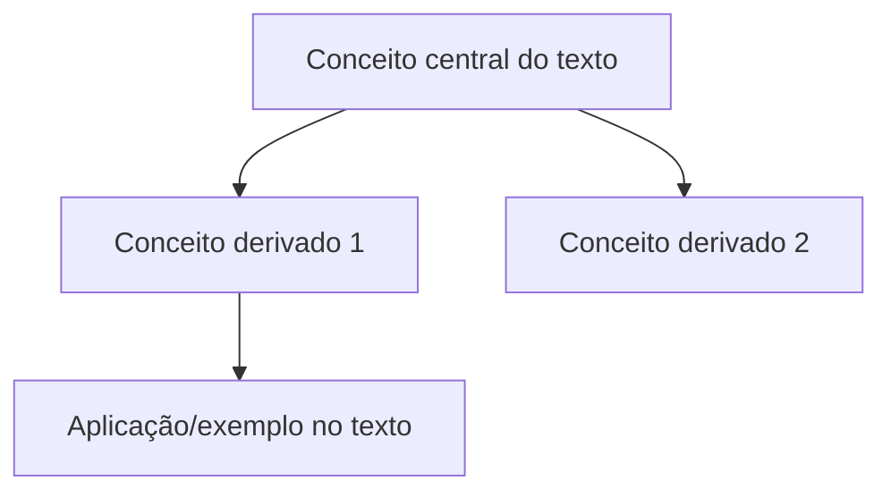

# Mapa conceitual — [Título do texto]

## Conceitos centrais e relações

_(substituir pelos conceitos reais do texto; o diagrama acima é apenas o esqueleto)_

## Conexões com a base teórica deste repositório

| Conceito do texto | Autor já fichado em `/debates-teoricos/` | Relação |
|---|---|---|
| | | (reforça / tensiona / é pré-requisito de / é derivado de) |
