# Mapa conceitual — A autoridade que não se assina: deniabilidade prisional e liderança negativa no cárcere paulista

## Conceitos centrais e relações

```mermaid
graph TD
    Q["Pergunta de pesquisa:<br/>como a autoridade produz efeitos<br/>vinculantes preservando o<br/>anonimato de sua autoria?"]

    Q --> DP["Deniabilidade prisional<br/>(mecanismo)"]
    Q --> LN["Liderança negativa<br/>(agente do mecanismo)"]

    DP -->|contrasta com| WEB["Weber: dominação legítima<br/>pressupõe fonte identificável"]
    DP -->|revisa| FOU["Foucault: poder capilar / panóptico<br/>disciplina pela VISIBILIDADE potencial"]
    DP -->|inverte a lógica de| FOU
    DP -->|desenvolve| SIM["Simmel: sociologia do segredo<br/>(segredo produz vínculo e hierarquia)"]
    DP -->|radicaliza| SYK["Sykes: corrupção da autoridade<br/>(negociação informal agente-preso)"]
    DP -->|opera via| TEC["Tecnologias de circulação:<br/>pipas, códigos, intermediários"]

    TEC -->|metáfora com ressalva| CAS["Castells: sociedade em rede<br/>(rede que dissolve o centro,<br/>não que o expõe)"]
    TEC -->|explicado por| SCO["Scott: transcrito oculto /<br/>armas dos fracos"]
    TEC -->|circula nos interstícios de| GOF["Goffman: instituição total<br/>(rotina saturada)"]

    LN -->|mérito + recusa pública| SIM
    LN -->|comparável a| GAM["Gambetta: códigos do submundo<br/>(omertà siciliana)"]
    LN -->|ancorado em| BIO["Biondi: etnografia do PCC<br/>(sintonia, proceder, partido)"]

    DP -->|caso central| EP["Episódio da 'virada':<br/>rebelião, lideranças somem,<br/>ordem persiste"]
    EP -->|hipótese não decidida| H1["H1: posição institucionalizada<br/>sobrevive ao ocupante"]
    EP -->|hipótese alternativa| H2["H2: liderança circunstancial<br/>produzida pela própria crise"]

    DP --> ECO["Economia da vida e da morte<br/>(seção 4): identificar-se é risco de morte"]
    ECO -->|LACUNA identificada nesta análise| MBE["Mbembe: necropolítica<br/>(não mobilizado no texto,<br/>mas tematicamente pedido)"]
    ECO -->|questão em aberto| ESTADO["Estado se beneficia,<br/>por omissão, da ordem sem autoria?<br/>(não testado neste artigo)"]

    DP --> EMANC["Caminhos de emancipação crítica"]
    EMANC -->|pedagogia| HOO["hooks: pedagogia engajada"]
    EMANC -->|ética| DUS["Dussel: prioridade da vida do Outro"]
    EMANC -->|não é| EXPO["exposição pública dos dominados<br/>(rejeitado explicitamente)"]
    EMANC -->|é| RESP["responsabilização do lado estatal"]

    style MBE stroke-dasharray: 5 5
    style ESTADO stroke-dasharray: 5 5
```

## Conexões com a base teórica deste repositório

| Conceito do texto | Autor já fichado em `/debates-teoricos/` | Relação |
|---|---|---|
| Poder capilar vs. deniabilidade (invisibilidade categórica vs. visibilidade potencial) | [Foucault](../../debates-teoricos/foucault-disciplina-biopoder.md) | Tensiona — o artigo inverte o mecanismo disciplinar foucaultiano |
| Corrupção da autoridade / negociação informal | [Sykes](../../debates-teoricos/sykes-corrupcao-da-autoridade.md) | É derivado de — a deniabilidade radicaliza a lógica sykesiana ao tornar anônima também a instância negociadora |
| Instituição total, interstícios da rotina | [Goffman](../../debates-teoricos/goffman-instituicao-total.md) | Reforça — a rotina saturada da instituição total é onde a circulação encontra brecha |
| Economia da vida e da morte na reivindicação da autoria | [Mbembe](../../debates-teoricos/mbembe-necropolitica.md) | É pré-requisito de (não usado, mas pertinente) — ver lacuna apontada em `analise-critica.md` |

## Observação

Weber, Simmel, Scott, Castells, Gambetta, Biondi, hooks e Dussel ainda não têm ficha própria em [`/debates-teoricos/`](../../debates-teoricos/README.md) — este artigo é candidato natural a motivar a criação dessas fichas, especialmente Simmel (sociologia do segredo) e Gambetta (códigos do submundo), diretamente relevantes ao eixo de debates teóricos deste repositório.
